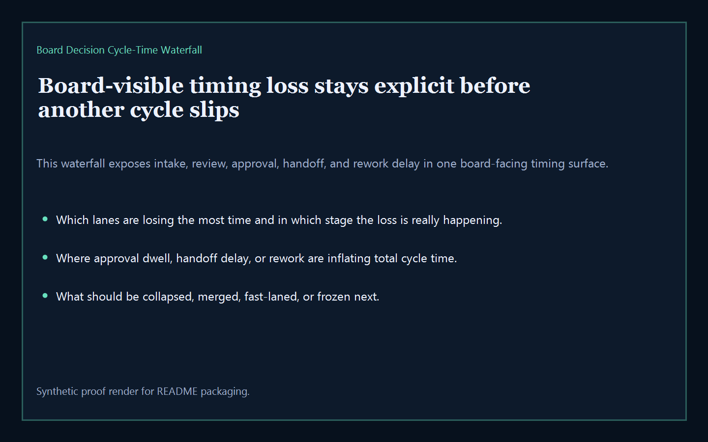
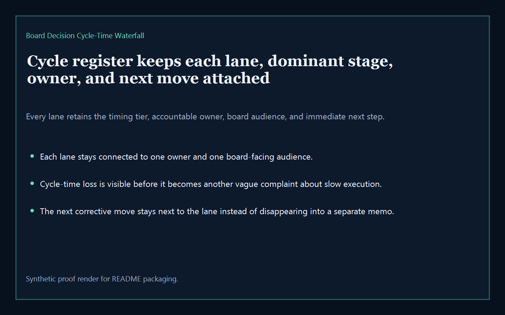
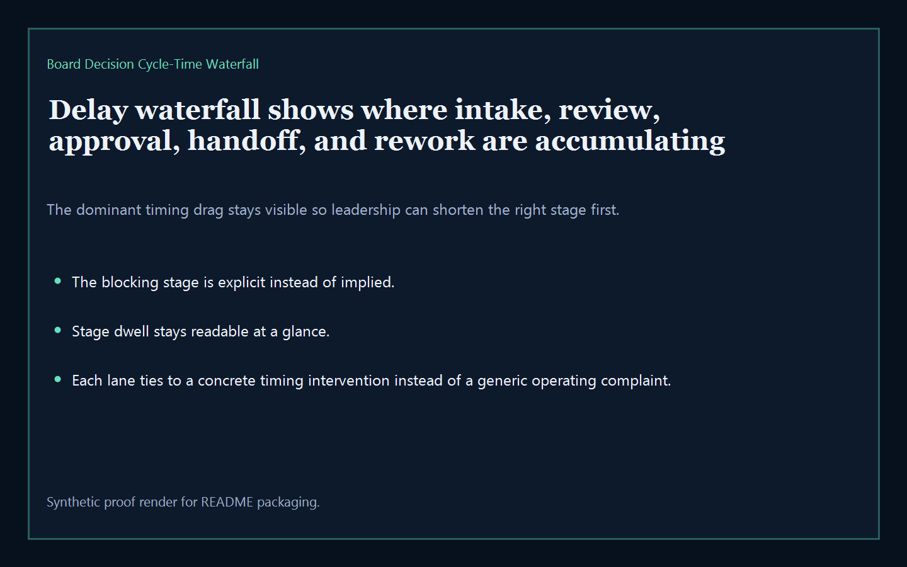
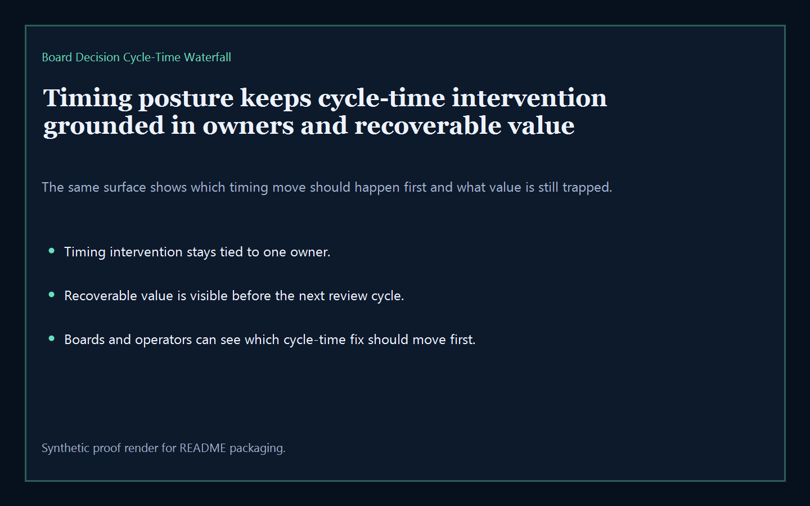

# Board Decision Cycle-Time Waterfall

Board-ready executive-intelligence surface for exposing board-decision cycle-time loss, review-stage delay, approval dwell, and timing waterfall pressure across the broader Kinetic Gain suite.

- Live: `http://waterfall.kineticgain.com/`
- Repo: `mizcausevic-dev/board-decision-cycle-time-waterfall`

## Why this matters

Leaders need one board-readable timing surface that shows where review stages, approval dwell, handoff delays, and rework are accumulating before another board cycle turns local drag into measurable cycle-time loss.

## What it includes

- TypeScript executive-intelligence surface for tracking stage dwell, approval wait, handoff delay, rework load, and cycle-time loss
- synthetic lanes across multiple sectors, owner groups, and board-visible timing risks
- reusable outputs for cycle register, delay waterfall, timing posture, timing pressure, and board-ready next-move prompts
- prerendered static site, JSON payloads, screenshots, and docs

## Routes

- `/`
- `/cycle-register`
- `/delay-waterfall`
- `/timing-posture`
- `/verification`
- `/docs`

## Local run

```bash
cd board-decision-cycle-time-waterfall
npm install
npm run verify
npm run prerender
npm run render:assets
```

## CLI

```bash
npx board-decision-cycle-time-waterfall fixtures/board-decision-cycle-time-waterfall.json --format summary
npx board-decision-cycle-time-waterfall fixtures/board-decision-cycle-time-waterfall-clean.json --format json
```

## Docs

- [Architecture](docs/architecture.md)
- [Origin](docs/ORIGIN.md)
- [Kinetic Gain Embedded](docs/KINETIC_GAIN_EMBEDDED.md)

## Screenshots





